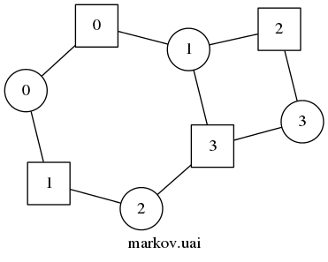

=================================================================
uai2dot: convert ".uai" graphical models to DOT (Graphviz) format
=================================================================

Visualizing a graphical model is a great way to gain some quick 
insight into a distribution's structure. This script will parse 
a model description in the 
`UAI08 file format <http://graphmod.ics.uci.edu/uai08/FileFormat>`_
and output a representation of the corresponding factor graph, 
Markov random field, or Bayesian network in the DOT language 
used by Graphviz. In addition to Graphviz's own visualization 
algorithms, files in this format are compatible with a variety 
of other graph visualization packages.

Sample factor graph
===================

markov.uai::

   MARKOV
   4
   2 2 2 2
   4
   2 0 1
   2 0 2
   2 1 3
   3 1 2 3
   4 1 1 1 1
   4 1 1 1 1
   4 1 1 1 1
   8 1 1 1 1 1 1 1 1

markov.dot::

   graph "markov.uai" {
   node [shape=circle, fixedsize=true]; V0 [label=0]; V1 [label=1]; V2 [label=2]; V3 [label=3];
   node [shape=square, fixedsize=true]; F0 [label=0]; F1 [label=1]; F2 [label=2]; F3 [label=3];
   F0 -- V0;
   F0 -- V1;
   F1 -- V0;
   F1 -- V2;
   F2 -- V1;
   F2 -- V3;
   F3 -- V1;
   F3 -- V2;
   F3 -- V3;
   overlap=scale;
   label="markov.uai";
   }

markov.png:

   Generated with graphviz using the "neato" layout.
